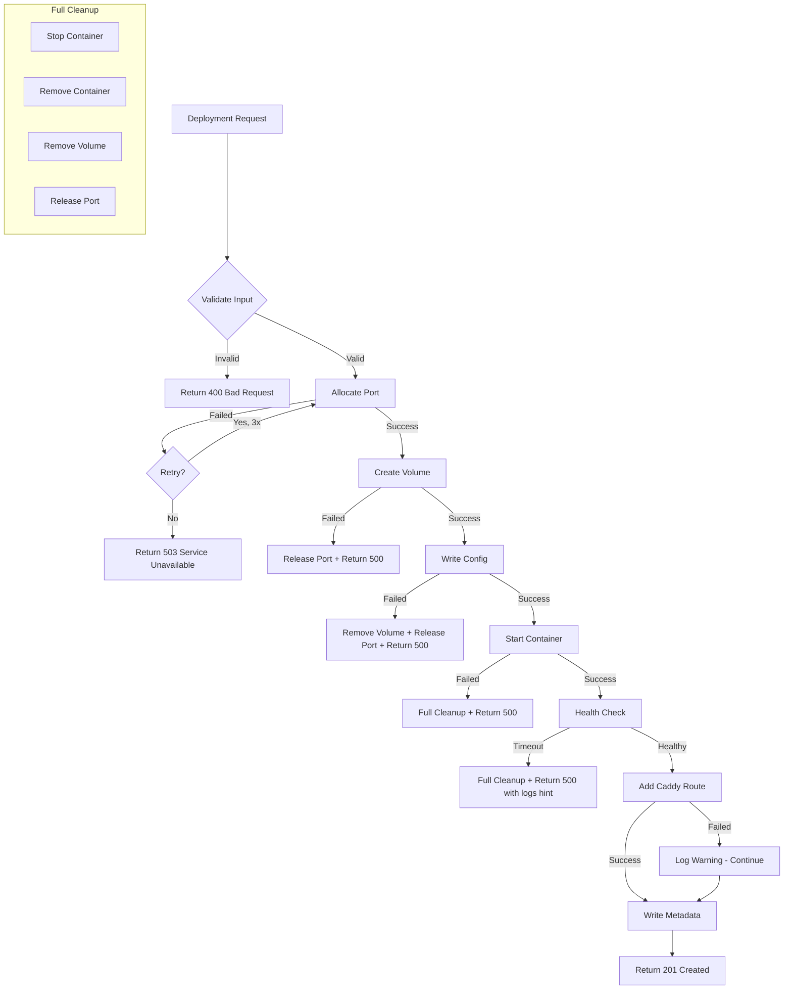
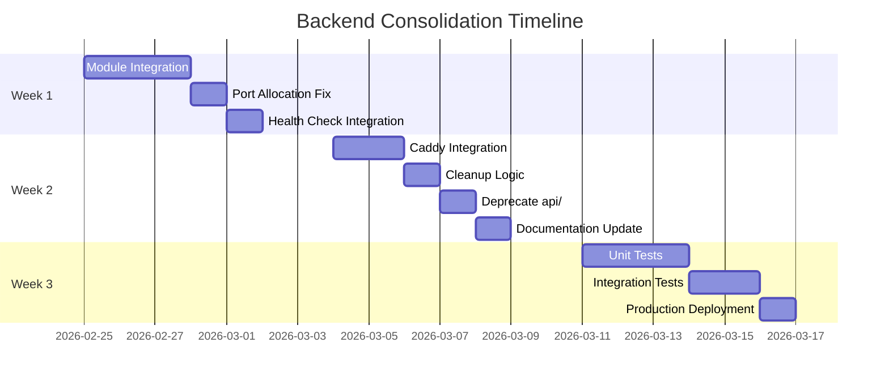
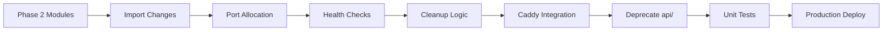

# Backend Consolidation - Detailed Implementation Plan

**Date:** 2026-02-25  
**Status:** Ready for Implementation  
**Prerequisite:** Phase 2 modules created (utils, port-manager, health, caddy)

---

## Executive Summary

This document provides detailed implementation instructions for integrating the newly created modules into [`agentbot-backend/src/index.ts`](agentbot-backend/src/index.ts) and deprecating the legacy [`api/`](api/) folder.

---

## Part 1: Module Integration into index.ts

### 1.1 Current State Analysis

The current [`index.ts`](agentbot-backend/src/index.ts) has these issues:

| Line(s) | Issue | Solution |
|---------|-------|----------|
| 70-80 | Inline `runCommand()` without retry | Import from `./utils` |
| 82 | Inline `escapeShellArg()` | Import from `./utils` |
| 244-249 | `getNextPort()` race condition | Use `allocatePort()` from `./lib/port-manager` |
| 266-280 | Inline `containerStatus()` | Import `getContainerStatus()` from `./utils` |
| 549-558 | No health check after container start | Add `checkContainerHealth()` |
| 563 | No Caddy route for subdomain | Add `addCaddyRoute()` |
| 581-584 | No cleanup on failure | Add `cleanupContainer()` and `releasePort()` |

### 1.2 Import Changes

**Before (lines 1-8):**
```typescript
import express, { Request, Response } from 'express';
import inviteRouter from './invite';
import cors from 'cors';
import dotenv from 'dotenv';
import { exec } from 'child_process';
import { promises as fs } from 'fs';
import path from 'path';
```

**After:**
```typescript
import express, { Request, Response } from 'express';
import inviteRouter from './invite';
import cors from 'cors';
import dotenv from 'dotenv';
import { promises as fs } from 'fs';
import path from 'path';

// Import new modules
import { 
  runCommand, 
  escapeShellArg, 
  cleanupContainer, 
  containerExists,
  getContainerStatus,
  sleep 
} from './utils';
import { allocatePort, releasePort, getAllocatedPort } from './lib/port-manager';
import { checkContainerHealth, waitForHealthy } from './lib/health';
import { addCaddyRoute, removeCaddyRoute, getAgentsDomain, getAgentUrl } from './services/caddy';
```

### 1.3 Remove Duplicate Functions

After adding imports, remove these inline functions:

| Function | Lines | Replacement |
|----------|-------|-------------|
| `runCommand()` | 70-80 | Import from `./utils` |
| `escapeShellArg()` | 82 | Import from `./utils` |
| `readPorts()` | 231-238 | Use `getAllocatedPort()` |
| `writePorts()` | 240-242 | Handled by `allocatePort()` |
| `getNextPort()` | 244-249 | Replace with `allocatePort()` |
| `containerStatus()` | 266-280 | Import `getContainerStatus()` from `./utils` |

### 1.4 Enhanced Deployment Flow

**Current deployment (lines 473-585):**
```
1. Validate input
2. Check if container exists
3. Create volume
4. Write config
5. Start container
6. Allocate port (race condition!)
7. Write metadata
8. Return success (no health check!)
```

**New deployment flow:**
```
1. Validate input
2. Check if container exists → return if active
3. Allocate port atomically (with file lock)
4. Create volume
5. Write config
6. Start container
7. Wait for health check (max 60s)
8. If unhealthy → cleanup + release port + return error
9. Add Caddy route
10. Write metadata
11. Return success with subdomain URL
```

### 1.5 Detailed Code Changes

#### Change 1: Deployment Port Allocation

**Before (lines 540-541):**
```typescript
const ports = await readPorts();
const assignedPort = ports[safeAgentId] || await getNextPort();
```

**After:**
```typescript
// Atomic port allocation - prevents race conditions
const assignedPort = await allocatePort(safeAgentId);
```

#### Change 2: Add Health Check After Container Start

**Before (lines 549-558):**
```typescript
await runCommand(
  [
    'docker run -d',
    `--name ${containerName}`,
    '--restart unless-stopped',
    `-v ${volumeName}:/home/node/.openclaw`,
    `-p ${assignedPort}:18789`,
    OPENCLAW_IMAGE,
  ].join(' '),
);

// Immediately return success without checking health
```

**After:**
```typescript
await runCommand(
  [
    'docker run -d',
    `--name ${containerName}`,
    '--restart unless-stopped',
    `-v ${volumeName}:/home/node/.openclaw`,
    `-p ${assignedPort}:18789`,
    '--memory=1280m',
    '--cpus=0.5',
    OPENCLAW_IMAGE,
  ].join(' '),
);

// Wait for container to be healthy (max 60 seconds)
const isHealthy = await waitForHealthy(containerName, 60000);

if (!isHealthy) {
  // Rollback on failure
  await cleanupContainer(containerName, volumeName);
  await releasePort(safeAgentId);
  
  res.status(500).json({ 
    error: 'Container failed to start within timeout',
    hint: 'Check Docker logs for details'
  });
  return;
}
```

#### Change 3: Add Caddy Route

**Before (lines 563-571):**
```typescript
const subdomain = `${safeAgentId}.${AGENTS_DOMAIN}`;
await writeAgentMetadata({
  agentId: safeAgentId,
  createdAt: new Date().toISOString(),
  plan: config.plan || 'free',
  aiProvider: config.aiProvider || 'openrouter',
  port: assignedPort,
  subdomain,
});
```

**After:**
```typescript
// Add Caddy route for subdomain access
const subdomain = await addCaddyRoute(safeAgentId, assignedPort);

await writeAgentMetadata({
  agentId: safeAgentId,
  createdAt: new Date().toISOString(),
  plan: config.plan || 'free',
  aiProvider: config.aiProvider || 'openrouter',
  port: assignedPort,
  subdomain,
});
```

#### Change 4: Add Cleanup on Failure

**Before (lines 581-584):**
```typescript
} catch (error: unknown) {
  const message = error instanceof Error ? error.message : 'Deployment failed';
  res.status(500).json({ error: message });
}
```

**After:**
```typescript
} catch (error: unknown) {
  // Cleanup on failure
  await cleanupContainer(containerName, volumeName);
  await releasePort(safeAgentId);
  
  const message = error instanceof Error ? error.message : 'Deployment failed';
  res.status(500).json({ error: message });
}
```

### 1.6 Agent Deletion Enhancement

Add Caddy route removal when deleting an agent:

**Add to DELETE endpoint (around line 466):**
```typescript
app.delete('/api/agents/:id', authenticate, async (req: Request, res: Response) => {
  const { id } = req.params;
  const containerName = getContainerName(id);
  
  try {
    // Remove Caddy route
    await removeCaddyRoute(id);
    
    // Stop and remove container
    await runCommand(`docker stop ${containerName}`);
    await runCommand(`docker rm ${containerName}`);
    
    // Release port
    await releasePort(id);
    
    // Remove metadata
    try {
      await fs.unlink(agentFilePath(id));
    } catch {}
    
    res.json({ id, message: 'Agent deleted' });
  } catch (error: unknown) {
    const message = error instanceof Error ? error.message : 'Delete failed';
    res.status(500).json({ error: message });
  }
});
```

---

## Part 2: Deprecate api/ Folder

### 2.1 Create DEPRECATED.md

Create file: [`api/DEPRECATED.md`](api/DEPRECATED.md)

```markdown
# ⚠️ DEPRECATED - This API is No Longer Active

**Deprecated:** 2026-02-25  
**Replacement:** [`agentbot-backend/`](../agentbot-backend/)

## Migration Guide

| Old Endpoint | New Endpoint |
|--------------|--------------|
| `GET /health` | `GET http://localhost:3001/health` |
| `POST /deploy` | `POST http://localhost:3001/api/deployments` |
| `GET /agents` | `GET http://localhost:3001/api/agents` |
| `DELETE /agents/:id` | `DELETE http://localhost:3001/api/agents/:id` |

## Why This Was Deprecated

1. **Duplication:** Both `api/` and `agentbot-backend/` performed similar functions
2. **Inconsistency:** `api/` uses JavaScript, `agentbot-backend/` uses TypeScript
3. **Maintenance:** Single backend is easier to maintain
4. **Features:** New backend has health checks, atomic ports, Caddy integration

## Timeline

- **2026-02-25:** Deprecated, no new deployments
- **2026-03-15:** Scheduled for removal

## Questions

Contact the development team or see [`plans/BACKEND_CONSOLIDATION_PLAN.md`](../plans/BACKEND_CONSOLIDATION_PLAN.md)
```

### 2.2 Files to Update

| File | Change |
|------|--------|
| [`README.md`](README.md) | Update API references to port 3001 |
| [`docs/ARCHITECTURE.md`](docs/ARCHITECTURE.md) | Remove api/ from diagrams |
| [`docker-compose.yml`](docker-compose.yml) | Remove api service if present |
| [`start-dev.sh`](start-dev.sh) | Remove api startup |

---

## Part 3: Unit Tests

### 3.1 Test File Structure

```
agentbot-backend/
├── src/
│   └── ...
├── tests/
│   ├── utils.test.ts
│   ├── port-manager.test.ts
│   ├── health.test.ts
│   ├── caddy.test.ts
│   └── integration.test.ts
└── jest.config.ts
```

### 3.2 Test Cases

#### tests/utils.test.ts

```typescript
import { runCommand, escapeShellArg, cleanupContainer } from '../src/utils';

describe('Utils', () => {
  describe('escapeShellArg', () => {
    it('should escape single quotes', () => {
      expect(escapeShellArg("test'value")).toBe("'test'\\''value'");
    });
    
    it('should wrap in quotes', () => {
      expect(escapeShellArg('test')).toBe("'test'");
    });
    
    it('should handle empty string', () => {
      expect(escapeShellArg('')).toBe("''");
    });
  });
  
  describe('runCommand', () => {
    it('should execute echo command', async () => {
      const { stdout } = await runCommand('echo hello');
      expect(stdout).toBe('hello');
    });
    
    it('should retry on failure when retries option set', async () => {
      const start = Date.now();
      try {
        await runCommand('exit 1', { retries: 2, retryDelay: 100 });
      } catch {}
      const duration = Date.now() - start;
      // Should have retried twice with 100ms delay
      expect(duration).toBeGreaterThanOrEqual(200);
    });
    
    it('should throw on command failure', async () => {
      await expect(runCommand('exit 1')).rejects.toThrow();
    });
  });
});
```

#### tests/port-manager.test.ts

```typescript
import { allocatePort, releasePort, getAllocatedPort } from '../src/lib/port-manager';
import fs from 'fs/promises';
import path from 'path';

const TEST_DATA_DIR = '/tmp/agentbot-test-ports';

describe('Port Manager', () => {
  beforeAll(async () => {
    process.env.DATA_DIR = TEST_DATA_DIR;
    await fs.mkdir(TEST_DATA_DIR, { recursive: true });
  });
  
  afterAll(async () => {
    await fs.rm(TEST_DATA_DIR, { recursive: true, force: true });
  });
  
  beforeEach(async () => {
    // Clean ports file before each test
    try {
      await fs.unlink(path.join(TEST_DATA_DIR, 'ports.json'));
    } catch {}
  });
  
  describe('allocatePort', () => {
    it('should allocate unique ports', async () => {
      const port1 = await allocatePort('agent-1');
      const port2 = await allocatePort('agent-2');
      expect(port1).not.toBe(port2);
    });
    
    it('should return same port for same agent', async () => {
      const port1 = await allocatePort('agent-same');
      const port2 = await allocatePort('agent-same');
      expect(port1).toBe(port2);
    });
    
    it('should handle concurrent allocations', async () => {
      const ports = await Promise.all([
        allocatePort('concurrent-1'),
        allocatePort('concurrent-2'),
        allocatePort('concurrent-3'),
        allocatePort('concurrent-4'),
        allocatePort('concurrent-5'),
      ]);
      
      // All ports should be unique
      expect(new Set(ports).size).toBe(5);
    });
  });
  
  describe('releasePort', () => {
    it('should release allocated port', async () => {
      const port = await allocatePort('to-release');
      await releasePort('to-release');
      const retrieved = await getAllocatedPort('to-release');
      expect(retrieved).toBeNull();
    });
  });
});
```

#### tests/health.test.ts

```typescript
import { checkContainerHealth, waitForHealthy } from '../src/lib/health';

describe('Health Checks', () => {
  describe('checkContainerHealth', () => {
    it('should return unhealthy for nonexistent container', async () => {
      const health = await checkContainerHealth('nonexistent-container-xyz');
      expect(health.status).toBe('unhealthy');
    });
    
    it('should include lastCheck timestamp', async () => {
      const health = await checkContainerHealth('nonexistent');
      expect(health.lastCheck).toBeDefined();
      expect(new Date(health.lastCheck)).toBeInstanceOf(Date);
    });
  });
  
  describe('waitForHealthy', () => {
    it('should return false for nonexistent container', async () => {
      const result = await waitForHealthy('nonexistent-container', 5000);
      expect(result).toBe(false);
    });
    
    it('should timeout and return false', async () => {
      const start = Date.now();
      const result = await waitForHealthy('nonexistent', 2000);
      const duration = Date.now() - start;
      
      expect(result).toBe(false);
      expect(duration).toBeGreaterThanOrEqual(1900);
    });
  });
});
```

#### tests/caddy.test.ts

```typescript
import { addCaddyRoute, removeCaddyRoute, getAgentUrl, getAgentsDomain } from '../src/services/caddy';
import fs from 'fs/promises';
import path from 'path';

const TEST_CADDY_FILE = '/tmp/test-Caddyfile';

describe('Caddy Integration', () => {
  beforeAll(() => {
    process.env.CADDY_FILE = TEST_CADDY_FILE;
    process.env.AGENTS_DOMAIN = 'test.agents.local';
  });
  
  beforeEach(async () => {
    try {
      await fs.unlink(TEST_CADDY_FILE);
    } catch {}
  });
  
  describe('getAgentsDomain', () => {
    it('should return configured domain', () => {
      expect(getAgentsDomain()).toBe('test.agents.local');
    });
  });
  
  describe('getAgentUrl', () => {
    it('should return full agent URL', () => {
      expect(getAgentUrl('my-agent')).toBe('https://my-agent.test.agents.local');
    });
  });
  
  describe('addCaddyRoute', () => {
    it('should create Caddyfile if not exists', async () => {
      const subdomain = await addCaddyRoute('test-agent', 19001);
      expect(subdomain).toBe('test-agent.test.agents.local');
      
      const content = await fs.readFile(TEST_CADDY_FILE, 'utf8');
      expect(content).toContain('test-agent.test.agents.local');
      expect(content).toContain('19001');
    });
    
    it('should not duplicate routes', async () => {
      await addCaddyRoute('dup-agent', 19002);
      await addCaddyRoute('dup-agent', 19002);
      
      const content = await fs.readFile(TEST_CADDY_FILE, 'utf8');
      const matches = content.match(/dup-agent\.test\.agents\.local/g);
      expect(matches?.length).toBe(1);
    });
  });
  
  describe('removeCaddyRoute', () => {
    it('should remove route from Caddyfile', async () => {
      await addCaddyRoute('remove-me', 19003);
      await removeCaddyRoute('remove-me');
      
      const content = await fs.readFile(TEST_CADDY_FILE, 'utf8');
      expect(content).not.toContain('remove-me.test.agents.local');
    });
  });
});
```

---

## Part 4: Smoke Test Checklist

After implementation, run these tests:

### Local Development

```bash
# 1. Start the backend
cd agentbot-backend && npm run dev

# 2. Health check
curl http://localhost:3001/health

# 3. Deploy an agent
curl -X POST http://localhost:3001/api/deployments \
  -H "Authorization: Bearer $INTERNAL_API_KEY" \
  -H "Content-Type: application/json" \
  -d '{"agentId":"test-001","config":{"telegramToken":"test","aiProvider":"openrouter"}}'

# 4. Check agent status
curl -H "Authorization: Bearer $INTERNAL_API_KEY" \
  http://localhost:3001/api/agents/test-001

# 5. Stop agent
curl -X POST -H "Authorization: Bearer $INTERNAL_API_KEY" \
  http://localhost:3001/api/agents/test-001/stop

# 6. Start agent
curl -X POST -H "Authorization: Bearer $INTERNAL_API_KEY" \
  http://localhost:3001/api/agents/test-001/start

# 7. Delete agent
curl -X DELETE -H "Authorization: Bearer $INTERNAL_API_KEY" \
  http://localhost:3001/api/agents/test-001
```

### Production Verification

- [ ] Deploy new agent via API
- [ ] Verify container is running (`docker ps`)
- [ ] Verify port is allocated (`cat /opt/agentbot/data/ports.json`)
- [ ] Verify Caddy route is added (`cat /etc/caddy/Caddyfile`)
- [ ] Verify subdomain resolves (DNS + Caddy)
- [ ] Stop agent → verify container stopped
- [ ] Start agent → verify container running
- [ ] Restart agent → verify container restarted
- [ ] Delete agent → verify cleanup (container, volume, port, Caddy route)

---

## Part 5: Rollback Plan

If issues arise after deployment:

1. **Revert index.ts changes** - Keep backup of original file
2. **Disable Caddy integration** - Set `CADDY_FILE=/dev/null`
3. **Use legacy port allocation** - Set `USE_LEGACY_PORTS=true` env var
4. **Fallback to api/** - Restart legacy API on port 3000

---

## Part 6: Error Handling Strategy

### 6.1 Error Categories

| Category | Examples | Recovery Strategy |
|----------|----------|-------------------|
| **Validation Errors** | Missing agentId, invalid telegramToken | Return 400, no cleanup needed |
| **Resource Errors** | Port allocation failed, volume creation failed | Return 503, partial cleanup |
| **Container Errors** | Docker run failed, health check timeout | Full cleanup, release port |
| **Network Errors** | Caddy reload failed, DNS issues | Log warning, continue (non-blocking) |
| **System Errors** | Disk full, permission denied | Return 500, log alert |

### 6.2 Error Handling Flow



### 6.3 Detailed Error Scenarios

#### Scenario 1: Port Allocation Failure

```typescript
// In deployment endpoint
let assignedPort: number;
try {
  assignedPort = await allocatePort(safeAgentId);
} catch (error) {
  // Port allocation failed - system resource issue
  console.error('Port allocation failed:', error);
  
  // Check if it's a lock contention issue
  if (error.message.includes('Could not acquire port lock')) {
    return res.status(503).json({
      error: 'System busy, please retry',
      code: 'PORT_LOCK_TIMEOUT',
      retryAfter: 5, // seconds
    });
  }
  
  // Generic port allocation failure
  return res.status(503).json({
    error: 'Unable to allocate port',
    code: 'PORT_ALLOCATION_FAILED',
  });
}
```

#### Scenario 2: Container Start Failure

```typescript
try {
  await runCommand(dockerRunCommand);
} catch (error) {
  // Container failed to start
  console.error('Container start failed:', error);
  
  // Attempt cleanup
  await cleanupContainer(containerName, volumeName);
  await releasePort(safeAgentId);
  
  // Parse Docker error for user-friendly message
  let userMessage = 'Container failed to start';
  let hint = 'Check Docker logs for details';
  
  if (error.message.includes('port is already allocated')) {
    userMessage = 'Port conflict detected';
    hint = 'Port was allocated to another container, retrying may help';
  } else if (error.message.includes('no such image')) {
    userMessage = 'Docker image not found';
    hint = 'Run: docker pull ' + OPENCLAW_IMAGE;
  } else if (error.message.includes('permission denied')) {
    userMessage = 'Permission denied';
    hint = 'Check Docker daemon permissions';
  }
  
  return res.status(500).json({
    error: userMessage,
    code: 'CONTAINER_START_FAILED',
    hint,
    details: process.env.NODE_ENV === 'development' ? error.message : undefined,
  });
}
```

#### Scenario 3: Health Check Timeout

```typescript
const isHealthy = await waitForHealthy(containerName, 60000);

if (!isHealthy) {
  // Get container logs for debugging
  let logs = '';
  try {
    const { stdout } = await runCommand(
      `docker logs ${containerName} --tail 50 2>&1`
    );
    logs = stdout;
  } catch {}
  
  // Cleanup
  await cleanupContainer(containerName, volumeName);
  await releasePort(safeAgentId);
  
  return res.status(500).json({
    error: 'Container failed health check within 60 seconds',
    code: 'HEALTH_CHECK_TIMEOUT',
    hint: 'Container may be misconfigured or resource-constrained',
    logs: process.env.NODE_ENV === 'development' ? logs : undefined,
  });
}
```

#### Scenario 4: Caddy Route Failure (Non-Blocking)

```typescript
try {
  const subdomain = await addCaddyRoute(safeAgentId, assignedPort);
} catch (error) {
  // Caddy failure is non-blocking - agent is still accessible via port
  console.warn('Caddy route addition failed:', error);
  
  // Log to monitoring system
  // await logWarning('caddy_route_failed', { agentId: safeAgentId, error });
  
  // Continue with deployment - use port-based URL as fallback
  const fallbackUrl = `http://${serverIp}:${assignedPort}`;
  
  // Note in response that subdomain routing is unavailable
  return res.status(201).json({
    id: `deploy-${safeAgentId}`,
    agentId: safeAgentId,
    url: fallbackUrl,
    subdomain: null,
    warning: 'Subdomain routing unavailable - using direct port access',
    status: 'active',
  });
}
```

### 6.4 Error Response Format

All error responses follow a consistent format:

```typescript
interface ErrorResponse {
  error: string;           // Human-readable error message
  code?: string;           // Machine-readable error code
  hint?: string;           // Suggestion for resolution
  details?: string;        // Technical details (dev mode only)
  logs?: string;           // Relevant logs (dev mode only)
  retryAfter?: number;     // Seconds to wait before retry
}
```

### 6.5 Error Logging

```typescript
// Centralized error logging
const logDeploymentError = (
  agentId: string,
  phase: 'validation' | 'port' | 'volume' | 'config' | 'container' | 'health' | 'caddy' | 'metadata',
  error: Error,
  context?: Record<string, unknown>
) => {
  const logEntry = {
    timestamp: new Date().toISOString(),
    level: 'error',
    agentId,
    phase,
    error: {
      message: error.message,
      stack: error.stack,
    },
    context,
  };
  
  // Write to error log
  console.error(JSON.stringify(logEntry));
  
  // In production, send to monitoring service
  // await sendToMonitoring(logEntry);
};
```

### 6.6 Graceful Degradation

| Feature | Failure Mode | Fallback |
|---------|--------------|----------|
| Port Allocation | Lock timeout | Return 503, suggest retry |
| Volume Creation | Disk full | Return 507 Insufficient Storage |
| Container Start | Image pull fail | Return 500 with pull command hint |
| Health Check | Timeout | Cleanup + return 500 with logs |
| Caddy Route | Reload fail | Continue with port URL, log warning |
| Metadata Write | File system error | Continue, log warning (non-critical) |

### 6.7 Retry Strategy

For transient failures, implement exponential backoff:

```typescript
const withRetry = async <T>(
  fn: () => Promise<T>,
  options: {
    maxRetries: number;
    baseDelay: number;
    maxDelay: number;
    shouldRetry: (error: Error) => boolean;
  }
): Promise<T> => {
  let lastError: Error;
  
  for (let attempt = 0; attempt <= options.maxRetries; attempt++) {
    try {
      return await fn();
    } catch (error) {
      lastError = error;
      
      if (attempt === options.maxRetries || !options.shouldRetry(error)) {
        throw error;
      }
      
      const delay = Math.min(
        options.baseDelay * Math.pow(2, attempt),
        options.maxDelay
      );
      
      console.log(`Retry attempt ${attempt + 1} after ${delay}ms`);
      await sleep(delay);
    }
  }
  
  throw lastError;
};

// Usage
const port = await withRetry(
  () => allocatePort(agentId),
  {
    maxRetries: 3,
    baseDelay: 100,
    maxDelay: 1000,
    shouldRetry: (err) => err.message.includes('lock'),
  }
);
```

---

## Part 7: Monitoring & Alerting

### 7.1 Metrics to Track

| Metric | Type | Alert Threshold |
|--------|------|-----------------|
| `deployment_success_rate` | Percentage | < 95% |
| `deployment_duration_seconds` | Histogram | p99 > 120s |
| `health_check_failures_total` | Counter | > 5 in 5min |
| `port_allocation_conflicts_total` | Counter | > 0 |
| `caddy_route_failures_total` | Counter | > 3 in 1h |
| `container_crashes_total` | Counter | > 2 in 1h |

### 7.2 Health Check Endpoint Enhancement

```typescript
// Enhanced /health endpoint
app.get('/health', async (req: Request, res: Response) => {
  const checks = {
    server: 'ok',
    docker: 'unknown',
    caddy: 'unknown',
    diskSpace: 'unknown',
  };
  
  // Check Docker connectivity
  try {
    await runCommand('docker ping', { timeout: 5000 });
    checks.docker = 'ok';
  } catch {
    checks.docker = 'error';
  }
  
  // Check Caddy
  try {
    await runCommand('caddy validate --config ' + CADDY_FILE, { timeout: 5000 });
    checks.caddy = 'ok';
  } catch {
    checks.caddy = 'error';
  }
  
  // Check disk space
  try {
    const { stdout } = await runCommand('df -h /opt/agentbot | tail -1 | awk '{print $5}'');
    const usedPercent = parseInt(stdout.replace('%', ''));
    checks.diskSpace = usedPercent > 90 ? 'warning' : 'ok';
  } catch {
    checks.diskSpace = 'error';
  }
  
  const allHealthy = Object.values(checks).every(v => v === 'ok');
  
  res.status(allHealthy ? 200 : 503).json({
    status: allHealthy ? 'healthy' : 'degraded',
    timestamp: new Date().toISOString(),
    checks,
  });
});
```

---

## Part 8: Security Considerations

### 8.1 Threat Model

| Threat Vector | Risk Level | Mitigation |
|---------------|------------|------------|
| API Key Exposure | High | Environment variables, never log |
| Command Injection | Critical | Shell escaping, input validation |
| Unauthorized Access | High | Bearer token auth, rate limiting |
| Container Escape | Medium | Docker security options, user namespacing |
| Data Leakage | Medium | Encryption at rest, secure deletion |
| DoS via Resource Exhaustion | Medium | Rate limits, resource quotas |

### 8.2 Input Validation

#### Agent ID Validation

```typescript
// Strict validation for agent IDs
const sanitizeAgentId = (value: string): string => {
  // Only allow alphanumeric, underscore, hyphen
  const sanitized = value.replace(/[^a-zA-Z0-9_-]/g, '');
  
  // Enforce length limits
  if (sanitized.length < 3 || sanitized.length > 64) {
    throw new Error('Agent ID must be 3-64 characters');
  }
  
  // Prevent reserved names
  const reserved = ['admin', 'api', 'www', 'mail', 'ftp', 'localhost', 'test'];
  if (reserved.includes(sanitized.toLowerCase())) {
    throw new Error('Agent ID is reserved');
  }
  
  return sanitized;
};
```

#### Telegram Token Validation

```typescript
const validateTelegramToken = (token: string): boolean => {
  // Telegram bot tokens follow format: NNNNNNNNN:XXXXXXXXXX
  const tokenRegex = /^\d{8,10}:[A-Za-z0-9_-]{35}$/;
  return tokenRegex.test(token);
};

// In deployment endpoint
if (!validateTelegramToken(config.telegramToken)) {
  return res.status(400).json({
    error: 'Invalid Telegram token format',
    code: 'INVALID_TOKEN_FORMAT',
  });
}
```

#### Docker Image Validation

```typescript
// Already implemented in index.ts
const DOCKER_IMAGE_REGEX = /^(?:(?:[a-zA-Z0-9](?:[a-zA-Z0-9-]{0,61}[a-zA-Z0-9])?(?:\.[a-zA-Z0-9](?:[a-zA-Z0-9-]{0,61}[a-zA-Z0-9])?)*(?::[0-9]{2,5})?)\/)?[a-z0-9]+(?:[._-][a-z0-9]+)*(?:\/[a-z0-9]+(?:[._-][a-z0-9]+)*)*(?::[\w][\w.-]{0,127})?(?:@sha256:[A-Fa-f0-9]{64})?$/;

const isValidDockerImage = (value: string): boolean => DOCKER_IMAGE_REGEX.test(value);
```

### 8.3 Command Injection Prevention

#### Shell Escaping

All user inputs must be escaped before use in shell commands:

```typescript
// From utils/index.ts
export const escapeShellArg = (value: string): string =>
  `'${value.replace(/'/g, `'\\''`)}'`;

// Usage
const containerName = `openclaw-${sanitizeAgentId(agentId)}`;
await runCommand(`docker inspect ${escapeShellArg(containerName)}`);
```

#### Avoid eval-like Patterns

```typescript
// DANGEROUS - Never do this
const cmd = `docker exec ${userInput}`;  // Injection risk!

// SAFE - Use escaped arguments
const cmd = `docker exec ${escapeShellArg(sanitizeAgentId(userInput))}`;
```

### 8.4 Authentication & Authorization

#### API Key Security

```typescript
// Never log or expose API keys
const authenticate = (req: Request, res: Response, next: any) => {
  const auth = req.headers.authorization;
  
  if (!auth || !auth.startsWith('Bearer ')) {
    return res.status(401).json({ error: 'Unauthorized' });
  }
  
  const token = auth.substring(7);
  
  // Use constant-time comparison to prevent timing attacks
  if (!constantTimeCompare(token, API_KEY)) {
    // Log without revealing token
    console.warn('Failed auth attempt from:', req.ip);
    return res.status(403).json({ error: 'Forbidden' });
  }
  
  next();
};

// Constant-time string comparison
const constantTimeCompare = (a: string, b: string): boolean => {
  if (a.length !== b.length) return false;
  let result = 0;
  for (let i = 0; i < a.length; i++) {
    result |= a.charCodeAt(i) ^ b.charCodeAt(i);
  }
  return result === 0;
};
```

#### Rate Limiting

```typescript
import rateLimit from 'express-rate-limit';

// General API rate limit
const apiLimiter = rateLimit({
  windowMs: 15 * 60 * 1000, // 15 minutes
  max: 100, // 100 requests per window
  message: { error: 'Too many requests', code: 'RATE_LIMITED' },
});

// Stricter limit for deployment endpoint
const deployLimiter = rateLimit({
  windowMs: 60 * 60 * 1000, // 1 hour
  max: 10, // 10 deployments per hour
  message: { error: 'Deployment rate limit exceeded', code: 'DEPLOY_RATE_LIMITED' },
});

app.use('/api/', apiLimiter);
app.post('/api/deployments', deployLimiter, authenticate, deployHandler);
```

### 8.5 Container Security

#### Docker Security Options

```typescript
// Enhanced container security
const dockerRunArgs = [
  'docker run -d',
  `--name ${containerName}`,
  '--restart unless-stopped',
  `-v ${volumeName}:/home/node/.openclaw`,
  `-p ${assignedPort}:18789`,
  
  // Security options
  '--security-opt=no-new-privileges',     // Prevent privilege escalation
  '--cap-drop=ALL',                       // Drop all capabilities
  '--cap-add=NET_BIND_SERVICE',           // Add only what's needed
  '--security-opt=seccomp=unconfined',    // Only if needed for Node.js
  
  // Resource limits
  '--memory=1280m',
  '--memory-swap=1280m',                  // Disable swap
  '--cpus=0.5',
  '--pids-limit=100',                     // Limit processes
  
  // User namespace (if configured in Docker daemon)
  '--userns=host',                        // Or use remapped user
  
  // Read-only root filesystem (if supported)
  // '--read-only',
  // '--tmpfs /tmp',
  
  OPENCLAW_IMAGE,
];
```

#### Network Isolation

```typescript
// Create isolated network for agents
const AGENT_NETWORK = process.env.AGENT_NETWORK || 'agentbot-agents';

// Ensure network exists
await runCommand(`docker network create ${AGENT_NETWORK} 2>/dev/null || true`);

// Connect container to isolated network
await runCommand(`docker network connect ${AGENT_NETWORK} ${containerName}`);
```

### 8.6 Data Security

#### Sensitive Data Handling

```typescript
// Never log sensitive data
const createOpenClawConfig = (
  telegramToken: string,
  aiProvider: string,
  apiKey?: string,
  ownerIds?: string[],
): Record<string, unknown> => {
  // Log without secrets
  console.log(`Creating config for provider: ${aiProvider}`);
  
  // ... config creation ...
  
  return config;
};

// Secure config storage
const writeConfigSecurely = async (config: object, volumeName: string): Promise<void> => {
  const configJson = JSON.stringify(config, null, 2);
  const configBase64 = Buffer.from(configJson).toString('base64');
  
  // Use temporary container to write config
  await runCommand([
    'docker run --rm',
    `-v ${volumeName}:/target`,
    '-e OPENCLAW_CONFIG_B64="' + configBase64 + '"',
    'alpine',
    'sh -lc "echo $OPENCLAW_CONFIG_B64 | base64 -d > /target/openclaw.json && chmod 600 /target/openclaw.json"',
  ].join(' '));
  
  // Clear sensitive data from memory
  configBase64 = null;
};
```

#### Secure Deletion

```typescript
// Secure cleanup of agent data
const secureCleanup = async (agentId: string): Promise<void> => {
  const containerName = getContainerName(agentId);
  const volumeName = `openclaw-data-${agentId}`;
  
  // Stop container
  try {
    await runCommand(`docker stop ${containerName}`);
  } catch {}
  
  // Remove container
  try {
    await runCommand(`docker rm ${containerName}`);
  } catch {}
  
  // Securely wipe volume before removal
  try {
    await runCommand([
      'docker run --rm',
      `-v ${volumeName}:/data`,
      'alpine',
      'sh -lc "find /data -type f -exec shred -u {} \\; 2>/dev/null || rm -rf /data/*"',
    ].join(' '));
  } catch {}
  
  // Remove volume
  try {
    await runCommand(`docker volume rm ${volumeName}`);
  } catch {}
  
  // Release port
  await releasePort(agentId);
  
  // Remove Caddy route
  await removeCaddyRoute(agentId);
  
  // Remove metadata file
  try {
    await fs.unlink(agentFilePath(agentId));
  } catch {}
};
```

### 8.7 Audit Logging

```typescript
// Audit log for security events
interface AuditLogEntry {
  timestamp: string;
  event: string;
  agentId?: string;
  userId?: string;
  ip: string;
  userAgent?: string;
  result: 'success' | 'failure';
  details?: Record<string, unknown>;
}

const auditLog = (entry: Omit<AuditLogEntry, 'timestamp'>) => {
  const logEntry: AuditLogEntry = {
    ...entry,
    timestamp: new Date().toISOString(),
  };
  
  // Write to audit log file
  fs.appendFile(
    path.join(DATA_DIR, 'audit.log'),
    JSON.stringify(logEntry) + '\n'
  );
  
  // In production, send to SIEM
  // await sendToSIEM(logEntry);
};

// Usage in endpoints
app.post('/api/deployments', authenticate, async (req, res) => {
  const agentId = req.body.agentId;
  
  try {
    // ... deployment logic ...
    
    auditLog({
      event: 'DEPLOY_AGENT',
      agentId,
      ip: req.ip,
      userAgent: req.headers['user-agent'],
      result: 'success',
    });
    
    res.status(201).json({ ... });
  } catch (error) {
    auditLog({
      event: 'DEPLOY_AGENT',
      agentId,
      ip: req.ip,
      userAgent: req.headers['user-agent'],
      result: 'failure',
      details: { error: error.message },
    });
    
    res.status(500).json({ error: error.message });
  }
});
```

### 8.8 Security Checklist

#### Pre-Deployment

- [ ] `INTERNAL_API_KEY` is set and at least 32 characters
- [ ] `NODE_ENV=production` in production
- [ ] HTTPS enabled (via Caddy or reverse proxy)
- [ ] Rate limiting configured
- [ ] Docker daemon running with user namespace remapping
- [ ] Firewall rules restrict access to port 3001

#### Runtime

- [ ] Audit logs are being written
- [ ] Failed auth attempts are logged
- [ ] Container resource limits enforced
- [ ] Agent network isolation active
- [ ] No sensitive data in logs

#### Post-Incident

- [ ] Audit logs preserved
- [ ] Container images preserved for forensics
- [ ] Volume snapshots available
- [ ] API keys rotated if compromised

### 8.9 Security Headers

```typescript
import helmet from 'helmet';

app.use(helmet({
  contentSecurityPolicy: {
    directives: {
      defaultSrc: ["'self'"],
      frameAncestors: ["'none'"],
      xssProtection: true,
    },
  },
  hsts: {
    maxAge: 31536000,
    includeSubDomains: true,
    preload: true,
  },
  noSniff: true,
  referrerPolicy: { policy: 'strict-origin-when-cross-origin' },
}));

// Additional headers
app.use((req, res, next) => {
  res.setHeader('X-Content-Type-Options', 'nosniff');
  res.setHeader('X-Frame-Options', 'DENY');
  res.setHeader('X-XSS-Protection', '1; mode=block');
  next();
});
```

---

## Part 9: Implementation Timeline

### 9.1 Overall Schedule



### 9.2 Detailed Task Breakdown

#### Week 1: Core Integration (Feb 25 - Mar 3)

| Day | Tasks | Deliverables |
|-----|-------|--------------|
| **Day 1** (Feb 25) | Import changes, remove duplicate functions | Updated imports, cleaner code |
| **Day 2** (Feb 26) | Replace port allocation with atomic version | No race conditions |
| **Day 3** (Feb 27) | Add health checks to deployment flow | Verified healthy containers |
| **Day 4** (Feb 28) | Add cleanup on failure, error handling | Robust error recovery |
| **Day 5** (Mar 3) | Testing & bug fixes | Stable integration |

#### Week 2: Caddy & Cleanup (Mar 4 - Mar 10)

| Day | Tasks | Deliverables |
|-----|-------|--------------|
| **Day 1** (Mar 4) | Caddy route integration | Subdomain routing |
| **Day 2** (Mar 5) | Caddy route removal on delete | Clean cleanup |
| **Day 3** (Mar 6) | Deprecate api/ folder | DEPRECATED.md, updated docs |
| **Day 4** (Mar 7) | Documentation updates | README, ARCHITECTURE |
| **Day 5** (Mar 10) | Security review & hardening | Security checklist complete |

#### Week 3: Testing & Deployment (Mar 11 - Mar 17)

| Day | Tasks | Deliverables |
|-----|-------|--------------|
| **Day 1** (Mar 11) | Unit tests for utils | utils.test.ts |
| **Day 2** (Mar 12) | Unit tests for port-manager, health | port-manager.test.ts, health.test.ts |
| **Day 3** (Mar 13) | Unit tests for caddy | caddy.test.ts |
| **Day 4** (Mar 14) | Integration tests | Full deployment flow tested |
| **Day 5** (Mar 17) | Production deployment | Live on production |

### 9.3 Milestones

| Milestone | Target Date | Criteria |
|-----------|-------------|----------|
| **M1: Core Integration** | Feb 28 | Modules integrated, health checks working |
| **M2: Feature Complete** | Mar 7 | Caddy integration, api/ deprecated |
| **M3: Test Coverage** | Mar 14 | All unit tests passing, >80% coverage |
| **M4: Production Ready** | Mar 17 | Deployed to production, smoke tests pass |

### 9.4 Dependencies



### 9.5 Risk Mitigation Schedule

| Risk | Mitigation | When |
|------|------------|------|
| Integration breaks existing deployments | Keep backup of original index.ts | Before Day 1 |
| Health check timeout too aggressive | Make configurable via env var | Day 3 |
| Caddy reload fails | Add fallback to port-based URL | Day 1-2 (Week 2) |
| Tests fail in CI | Debug environment differences | Week 3 |
| Production deployment issues | Rollback plan ready | Before Mar 17 |

### 9.6 Daily Standup Template

```markdown
## Standup - [Date]

### Yesterday
- [Completed task 1]
- [Completed task 2]

### Today
- [ ] [Task 1]
- [ ] [Task 2]

### Blockers
- [Blocker description and mitigation]

### Metrics
- Tests passing: X/Y
- Coverage: Z%
- Open issues: N
```

### 9.7 Definition of Done

Each task is considered complete when:

- [ ] Code is written and follows project conventions
- [ ] Unit tests are written and passing
- [ ] Code review is complete
- [ ] Documentation is updated
- [ ] No regressions in existing functionality
- [ ] Security review complete (for security-related changes)

---

## Summary

| Phase | Tasks | Status |
|-------|-------|--------|
| Phase 2 | Create modules | ✅ Complete |
| Phase 3 | Integrate into index.ts | ⏳ Ready to implement |
| Phase 4 | Deprecate api/ folder | ⏳ Ready to implement |
| Phase 5 | Add unit tests | ⏳ Ready to implement |
| Phase 6 | Error handling | ✅ Documented |
| Phase 7 | Monitoring | ✅ Documented |
| Phase 8 | Security | ✅ Documented |
| Phase 9 | Timeline | ✅ Documented |

**Target Completion:** March 17, 2026

**Next Step:** Switch to Code mode and begin Day 1 tasks (import changes).
